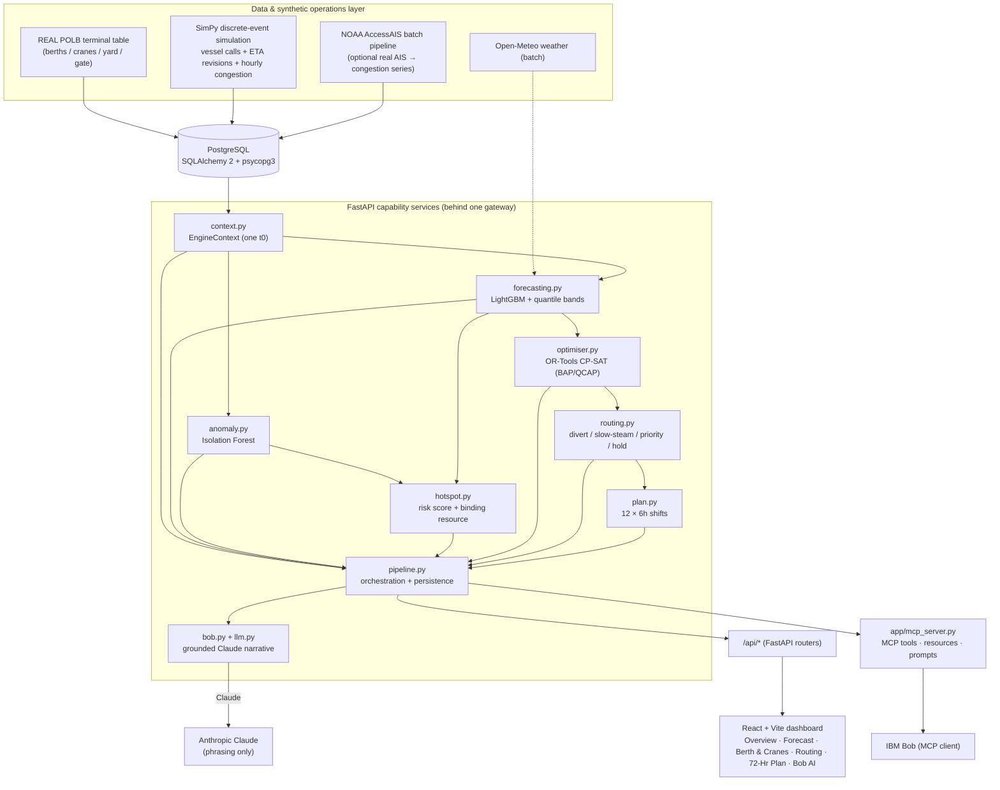

# Architecture — PortFlow SBX

Implementation of the technical plan (`3_Technical_Architecture_and_Build_Plan.md` §1–§3): a **FastAPI**
gateway over distinct capability services, a **React + Vite** dashboard, **PostgreSQL** persistence, and a
**SimPy** synthetic operations layer. All code lives under `src/`.

## End-to-end flow

**Data flow in words.** `seed.py` loads the REAL POLB terminal/berth/crane/yard/gate reference tables, then
runs the **SimPy** simulation to generate the vessel queue, ETA-revision history and the 14-day hourly
congestion series (`source="SIM"`). On first startup `main.py` auto-runs the **AIS generation pipeline**
(`pipelines/ais_generate.py`) which produces a realistic NOAA AccessAIS-format CSV and loads it as
`source="AIS"`, replacing the SimPy seed rows. `context.py` loads everything into one `EngineContext` with a
single model time `t0`. `forecasting.py` trains a **LightGBM** model per zone (point + quantile 0.1/0.9)
and rolls it out 72 h. `anomaly.py` runs an **Isolation Forest** per zone. `hotspot.py` computes the
composite risk score and names the binding resource. `optimiser.py` solves the berth-allocation +
quay-crane-assignment problem with **OR-Tools CP-SAT** and also computes a FIFO baseline.
`routing.py` turns forecast waits into diver/slow-steam/priority/hold recommendations. `plan.py` fuses
everything into 12 × 6 h shifts. `pipeline.py` orchestrates and persists; the API routers expose it; the
React dashboard consumes it.

## Component table

| File | Responsibility | Tech |
|---|---|---|
| `backend/app/main.py` | FastAPI gateway, CORS, lifespan (auto-seed) | FastAPI |
| `backend/app/routers/*` | one router per capability behind the gateway | FastAPI |
| `backend/app/models.py` | full data model (spec §18 entity flow) | SQLAlchemy 2 |
| `backend/app/reference.py` | REAL POLB terminals + documented constants | — |
| `backend/app/seed.py` | reference seed + SimPy layer | SQLAlchemy + SimPy |
| `backend/app/services/simulation.py` | synthetic berth/crane/yard/gate operations | **SimPy** |
| `backend/app/services/forecasting.py` | congestion forecast + uncertainty bands | **LightGBM** |
| `backend/app/services/anomaly.py` | disruption / data-error detection | **scikit-learn IsolationForest** |
| `backend/app/services/hotspot.py` | risk score w1..w5 + binding constraint | deterministic |
| `backend/app/services/optimiser.py` | BAP/QCAP + FIFO baseline | **OR-Tools CP-SAT** |
| `backend/app/services/routing.py` | divert / slow-steam / priority / hold | rule engine |
| `backend/app/services/plan.py` | 12 × 6h plan (JSON + text) | — |
| `backend/app/services/llm.py` | plan narrative + grounded Q&A | **Anthropic Claude** |
| `backend/app/services/bob.py` | Bob brain (engines → grounded answer); shared by API + MCP | — |
| `backend/app/mcp_server.py` | MCP server: 11 tools + resources + prompts | **MCP (Model Context Protocol)** |
| `backend/app/services/context.py` | DB → EngineContext (one t0) | SQLAlchemy |
| `backend/app/services/pipeline.py` | orchestration + run persistence + caching | — |
| `frontend/src/App.tsx` | 6-tab dashboard | **React + Vite + Tailwind + Recharts** |
| `frontend/src/api.ts` | typed fetch client | — |

## Data model (PostgreSQL / SQLAlchemy)

`Terminal → Berth / Crane / YardZone / Gate → VesselCall (+EtaRevision) → CongestionObservation →
ForecastRun (+ForecastPoint) → HotspotFlag / AnomalyFlag → OptimiserRun (+Assignment) /
RoutingRecommendation → OperationsPlan → Scenario → ImpactAssessment (+ChatMessage)`.

`Terminal`/`Berth` capacity columns are REAL POLB fact-sheet figures; `VesselCall` and
`CongestionObservation` rows are generated by the AIS pipeline (`source="AIS"`) on startup — replaceable
by a genuine AccessAIS CSV drop-in via `POST /api/ais/generate` or the Quality page.

## Bob integration (load-bearing) — two directions, one brain

`services/bob.py` is the shared brain; `services/bob_agent.py` makes **IBM Bob itself** the narrative
engine. `services/llm.py` resolves the provider (`LLM_PROVIDER=auto|bob|claude|deterministic`).

1. **Bob → our engines (MCP).** Bob registers `app/mcp_server.py` and calls 11 engine tools
   (`forecast_congestion`, `rank_hotspots`, `optimise_berth_cranes`, `recommend_routing`,
   `generate_operations_plan`, `simulate_scenario`, …), reads 4 resources and uses 2 prompts. Each call
   actually runs LightGBM / OR-Tools CP-SAT / routing.
2. **Our app → Bob.** `POST /api/bob` and the 72h plan narrative run the **real Bob agent**
   (`bob run --format stream-json`); Bob fetches the data with the MCP tools above and answers from it.
   Every reply reports `provider` (`bob` \| `claude` \| `deterministic`) and the `actions` (MCP tool
   names) Bob executed, e.g.
   `provider=bob · mode=llm · actions=['mcp__portflow__rank_hotspots']`.

Recursion guard: the Bob child inherits `PORTFLOW_NO_BOB_AGENT=1`, so the MCP server's
`ask_operations_question` never re-enters Bob. Without a key the answer falls back to Claude, then to a
deterministic template over the **same engine numbers**. Registration + tool catalogue: [`bob-mcp.md`](bob-mcp.md).

## Mapping to the hackathon template

| Template | This repo |
|---|---|
| `src/forecasting/` | `src/backend/app/services/forecasting.py` |
| `src/optimiser/` | `src/backend/app/services/optimiser.py` |
| `src/routing/` | `src/backend/app/services/routing.py` |
| `src/bob_integration/` | `src/backend/app/routers/bob.py` + `src/backend/app/services/llm.py` |
| `src/data/` | `src/backend/app/reference.py` + `seed.py` + `simulation.py` + AIS pipeline |
| `src/.env.example` / `src/README.md` | `src/backend/.env.example` / `src/README.md` |
| `docs/` | problem-statement · solution-overview · architecture (this) · setup-guide |
| `demo/`, `presentation/`, `submission.yaml` | repo root |
