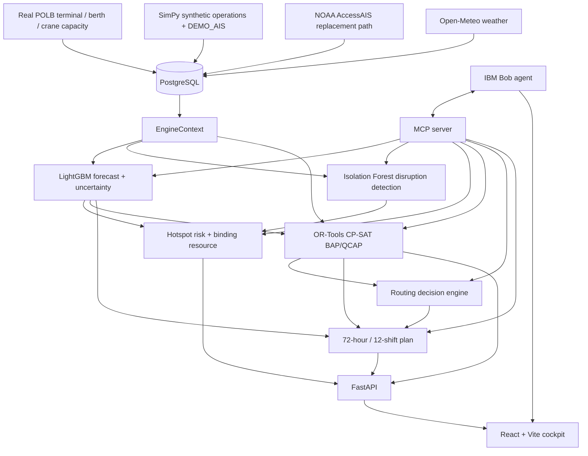

# Architecture — PortPulse AI

PortPulse AI implements the core L1 decision loop with a FastAPI gateway, React/Vite cockpit, PostgreSQL persistence, SimPy operations layer, ML forecasting, deterministic risk logic, OR-Tools CP-SAT optimisation and IBM Bob through MCP.

## End-to-end flow

## Architecture principle

**IBM Bob is the agentic interface, not the scheduler.** Bob can choose tools, inspect engine outputs and communicate decisions. Hard berth/crane feasibility is produced by OR-Tools CP-SAT; forecasts come from LightGBM; anomalies come from Isolation Forest; routing is deterministic.

There is no Claude or other external-LLM fallback. If Bob is unavailable, the application produces a deterministic briefing from the same engine output.

## Components

| Component | Responsibility |
|---|---|
| `simulation.py` | SimPy berth/crane/yard/gate operations layer |
| `forecasting.py` | 24/48/72h LightGBM forecast + quantile bands |
| `anomaly.py` | Isolation Forest + disruption classification |
| `hotspot.py` | composite risk + binding-resource attribution |
| `optimiser.py` | CP-SAT BAP/QCAP + FIFO baseline |
| `routing.py` | divert / slow-steam / priority / hold |
| `plan.py` | 12 × 6h operating plan + provenance |
| `bob.py` | intent routing + engine-grounded assistant |
| `bob_agent.py` | real IBM Bob CLI invocation |
| `mcp_server.py` | 11 operational tools + resources + prompts |
| `pipeline.py` | orchestration, persistence and caching |

## Data model

`Terminal → Berth / Crane / YardZone / Gate → VesselCall (+EtaRevision) → CongestionObservation → ForecastRun (+ForecastPoint) → HotspotFlag / AnomalyFlag → OptimiserRun (+Assignment) / RoutingRecommendation → OperationsPlan → Scenario → ImpactAssessment (+ChatMessage)`

Terminal/berth capacity is based on real POLB fact-sheet data. The demo vessel/operations history is explicitly labelled `DEMO_AIS`; real NOAA AccessAIS can replace that layer.

## Data ingestion and quality

- CSV schedule upload creates `VesselCall` and `EtaRevision` rows and triggers replanning.
- Data quality attributes vessels using `Terminal.zone_code == VesselCall.dest_zone_code` and reports missing identity fields rather than defaulting empty joins to 100%.
- Open-Meteo weather is refreshed on startup and through `/api/weather/refresh`.
- BTS PPFSP parsing is available as a benchmark/validation path, not a required live inference dependency.

## Performance

The prototype favors reproducibility and auditability over production dispatch latency. Cold forecasting is approximately 11 seconds and a cold full plan approximately 20–30 seconds; warm cached requests are approximately 1 second. These are documented prototype limitations.

## Scope lock

The hackathon MVP is **observe → predict → explain risk → optimise → route → plan → Bob**. Full live TOS/EDI integration, complete port-wide coverage, continuous online retraining, enterprise authentication and distributed scheduling are Phase-2 work. See [`submission-scope.md`](submission-scope.md).
