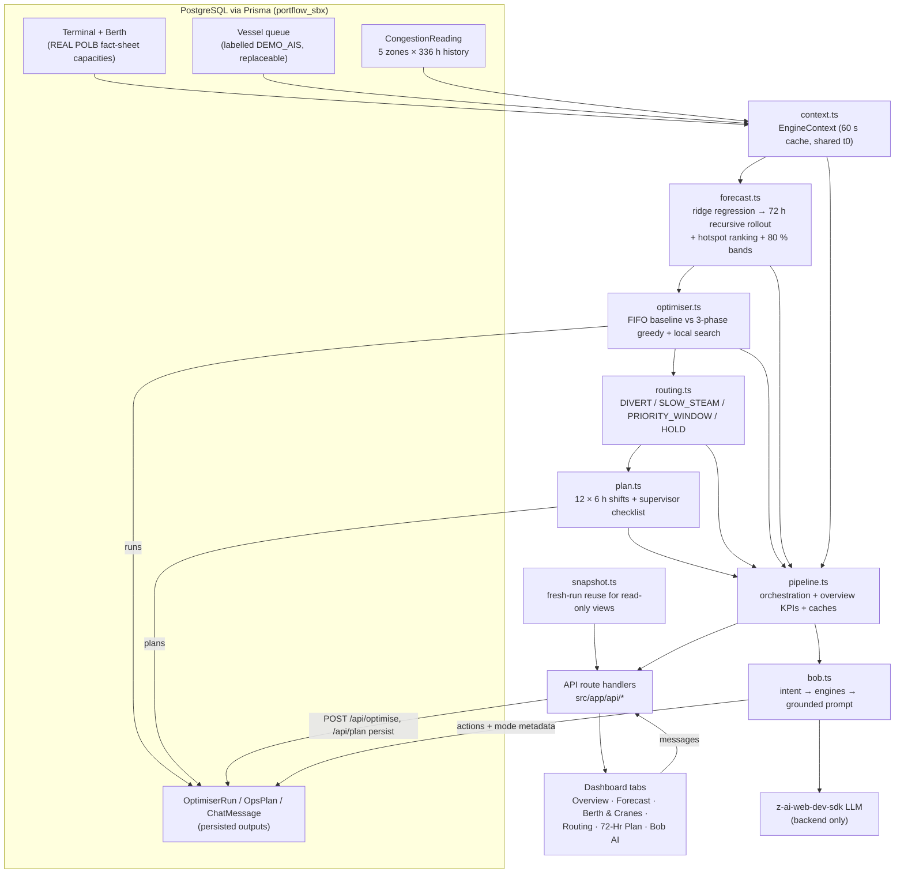

# Architecture — PortFlow SBX

Next.js 16 (App Router, TypeScript) single app on port 3000: React dashboard + API route handlers + four engine modules + Bob, all sharing a PostgreSQL database through Prisma. All project code lives in `src/` (the app root); paths below are relative to the repository root.

## End-to-end flow

Data flow in words: `context.ts` loads terminals, berths, the vessel queue and the per-zone hourly history from PostgreSQL into one `EngineContext` (single shared model time `t0`, 60-second TTL cache). `forecast.ts` trains and rolls out per zone; `optimiser.ts` consumes the vessels + berth constraints; `routing.ts` consumes vessels + forecast waits; `plan.ts` fuses all three. `pipeline.ts` is the single orchestration point the API routes and Bob both call, so the dashboard and Bob always see the same numbers. Persisted artifacts (`OptimiserRun`, `OpsPlan`, `ChatMessage`) are written by the POST endpoints and re-served by GETs.

## Component table

| File | Responsibility | Inputs → Outputs |
|---|---|---|
| `src/lib/engine/types.ts` | Shared engine contracts (zone codes, vessel/berth/forecast/optimiser/plan types) | — → types used by engines, APIs, UI |
| `src/lib/engine/context.ts` | Loads DB → `EngineContext` (terminals, berths, vessels, per-zone history), shared `t0`, 60 s TTL cache; `zoneCapacity()` | Prisma queries → `EngineContext` |
| `src/lib/engine/forecast.ts` | Congestion-index definition; schedule-aware ridge regression (14 features, λ=3.0, Gaussian elimination); 72 h damped recursive rollout (δ=0.75); 48 h holdout + 12 multi-origin rollouts → per-horizon σ, 80 % bands, MAE/R²/skill; driver attribution | history + vessels + capacity → `ForecastResult[]` per zone |
| `src/lib/engine/optimiser.ts` | FIFO first-fit baseline + 3-phase optimiser (priority selection → ready-time sequencing → swap search interleaved with gap insertion); real POLB feasibility constraints; metrics + deltas | vessels + berths + horizon params → `OptimiserOutput` |
| `src/lib/engine/routing.ts` | Rule recommender (DIVERT/SLOW_STEAM/PRIORITY_WINDOW/HOLD) on forecast waits; $32k/day cost model, alt-port table, reefer value | vessels + `predictedWaitFor()` → `RoutingRec[]` |
| `src/lib/engine/plan.ts` | Fuses forecast + assignments + routing into 12 × 6 h shifts (arrivals, berthings, crane deployment, alerts, routing deadlines, checklist) + text renderer | t0, vessels, assignments, forecasts, routing → `OpsPlanOutput` |
| `src/lib/engine/pipeline.ts` | Orchestration: `runForecasts` (cached by t0) → `runOptimiser` → `runRouting` → `buildOpsPlanOutput`; `buildOverview()` KPIs/alerts; `DATASET_NOTE` | context → all engine outputs + `OverviewData` |
| `src/lib/engine/snapshot.ts` | Reuses a persisted `OptimiserRun` if < 10 min old, else runs the optimiser (not persisted) for read-only views | context → `OptimiserOutput` |
| `src/lib/engine/bob.ts` | Bob intent router, engine data packs, grounded LLM call, deterministic fallback | message + history → `{ content, actions, mode }` |
| `src/lib/db.ts` | Prisma client singleton | — → `db` |
| `src/prisma/schema.prisma` | Data model (see below) | — → PostgreSQL schema |
| `src/prisma/seed.ts` | Real POLB terminal table + deterministic demo vessels/history (mulberry32, 38 vessels, 336 h × 5 zones) | — → seeded DB |
| `src/scripts/ais/*.ts` | Real-data pipeline: AccessAIS CSV → per-zone hourly congestion series → DB (`source: "AIS"`) | AIS CSV → `CongestionReading` rows |
| `src/app/api/**/route.ts` | HTTP surface (table below) | HTTP → engine calls / DB reads |
| `src/app/page.tsx` | Dashboard shell with 6 tabs | — → UI |
| `src/components/dashboard/*.tsx` | Tab implementations + shared widgets; `src/components/ui/*` are shadcn/ui primitives | API JSON → views |
| `src/lib/api.ts` | Typed fetch client for `/api/*` | — → typed responses |

## Data model (Prisma / PostgreSQL)

| Model | Purpose | Real vs demo |
|---|---|---|
| `Terminal` | POLB container terminals: code, pier, berth length ft, deepsea berths, gantry cranes, TEU capacity, zone code | **REAL** (POLB fact sheets) |
| `Berth` | Working berths per terminal: length, depth, max cranes | real totals split into working berths |
| `Vessel` | Queue: MMSI, name, carrier, class, LOA/beam/draft, moves, reefers, status (ANCHORAGE/DRIFTING/INBOUND), ETA + anchored hours, destination zone | **DEMO** (`DEMO_AIS` labelling policy) |
| `CongestionReading` | Hourly per-zone queue/wait/index; `hoursAgo` unique per zone; `source` = `DEMO_AIS` or `AIS` | demo by default, real via `src/scripts/ais` |
| `OptimiserRun` | Persisted optimiser runs (params, assignments, metrics, baseline, deltas, deferred) | engine output |
| `OpsPlan` | Persisted 72 h plans (summary, shifts, text) | engine output |
| `ChatMessage` | Bob conversation + `metaJson` (actions, mode) | runtime log |

## API endpoints

All routes are Next.js route handlers under `src/app/api/` (all engine routes `dynamic = "force-dynamic"`):

| Route | Method(s) | Purpose |
|---|---|---|
| `/api/overview` | GET | Live KPIs, per-zone status/trend, alerts, 72 h arrival timeline (calls forecast + optimiser first 24 h) |
| `/api/forecast` | GET (`?zone=Z-…`) | All-zone forecast summary + selected zone detail: 72 points with bands, history (last 96 h), hotspot rank, model card, `validation` (per-horizon MAE/σ/bias buckets + sampled residuals from the 12 multi-origin rollouts — rendered in the Forecast tab's model-validation view) |
| `/api/optimise` | GET / POST | GET latest persisted run; POST runs the optimiser now (fresh context) and persists it. POST accepts an optional JSON **what-if scenario** body: `{ "craneFactor": 0.5–1, "moveRatePerCraneHour": 20–35 }` — berth crane caps and productivity are impaired for BOTH the optimiser and the FIFO baseline, so the comparison stays fair (powering the Berth & Cranes tab scenario simulator) |
| `/api/routing` | GET | Routing recommendations + summary counts/total savings (uses forecast + optimiser) |
| `/api/plan` | GET (`?text=1`) / POST | GET latest stored plan (JSON or printable text); POST regenerates the full pipeline and persists |
| `/api/vessels` | GET | Vessel queue enriched with assignment status (berth, start hour, cranes, in-plan) — powers the Berth tab roster + detail dialog |
| `/api/export` | GET (`?type=assignments\|routing\|vessels\|forecast`) | CSV downloads (quoted, RFC-4180-style escaping) for spreadsheets — backs the CSV buttons in the UI |
| `/api/terminals` | GET | Real POLB terminal capacity table + port-wide POLB/POLA figures, with source note |
| `/api/bob` | GET / POST | GET chat history (last 50); POST a message → engine packs → LLM/deterministic answer, persisted with actions metadata |

## Bob integration — exactly where Bob sits

Bob is the natural-language surface over the same pipeline the tabs use. It is **load-bearing**: without the engines there is no answer, and every reply declares which tools produced it.

1. **Intent detection** (`bob.ts detectIntent`): regex router maps the message to `plan | optimise | routing | forecast | vessel | status` (e.g. "what's the congestion outlook for the next 72 hours?" → `plan` because of "72/plan/shift"; "which terminal is the hotspot?" → `forecast`).
2. **Pipeline calls** (`packForecast / packOptimise / packRouting / packPlan / packStatus / packVessel`): each pack **actually invokes the engines** via `pipeline.ts` — e.g. the `plan` pack runs forecast → optimiser → routing → plan in dependency order, then compacts the JSON (truncated to ~4.2 KB) into an `ENGINE DATA` payload. The `actions` list records the tool calls (`forecast.run`, `optimiser.run`, `routing.recommend`, `plan.generate`, `overview.get`, `vessels.query`).
3. **Grounded prompt**: the system prompt fixes Bob's role (PortFlow SBX ops assistant) and strict rules — *use ONLY the numbers in the ENGINE DATA block, never invent figures, name vessels/zones for risks (peak ≥ 75 or wait ≥ 48 h)*. The engine payload + last 6 chat turns + the user message go to the LLM.
4. **LLM call**: `z-ai-web-dev-sdk` (`ZAI.create()` → `chat.completions.create`), **backend-only** — the SDK is never imported client-side; the browser only talks to `POST /api/bob`.
5. **Persistence + actions metadata**: user and assistant messages are stored in `ChatMessage`; the assistant row's `metaJson` carries `{ actions: [...], mode: "llm" | "deterministic" }`, which the Bob AI tab renders (so a reviewer can see exactly which engines ran).
6. **Fallback path** (two layers):
   - *Engine failure* → catch → answer from a bare `overview.get` KPI snapshot, `mode: "deterministic"`.
   - *LLM failure / unavailable* → `deterministicAnswer(intent, …)` composes the reply **from the same engine output** the LLM would have seen (KPIs, top zones by forecast peak, utilisation, fleet burn). The actions metadata still lists the real engine calls, so even fallback answers remain engine-grounded and auditable.

In the flow diagram above: dashboard/Bob tab → `POST /api/bob` → `bob.ts` → `pipeline.ts` (engines) → grounded prompt → LLM → reply + actions → DB. Bob never invents data and never bypasses the engines.

## Mapping to the hackathon template structure

| Master-guide template | This repo | Note |
|---|---|---|
| `src/forecasting/` | `src/lib/engine/forecast.ts` (+ `pipeline.ts`) | ridge model + rollout + hotspot ranking |
| `src/optimiser/` | `src/lib/engine/optimiser.ts` | FIFO baseline + 3-phase optimiser |
| `src/routing/` | `src/lib/engine/routing.ts` | rule engine + cost model |
| `src/bob_integration/` | `src/lib/engine/bob.ts` + `src/app/api/bob/route.ts` | intent → engines → grounded LLM + fallback |
| `src/data/` | `src/prisma/schema.prisma`, `src/prisma/seed.ts`, `src/scripts/ais/` | data model, labelled demo generator, real AIS pipeline |
| `src/.env.example` | `src/.env.example` | `DATABASE_URL` template |
| `docs/` | `docs/problem-statement.md`, `solution-overview.md`, `architecture.md` (this file), `setup-guide.md` | |
| `demo/` | `demo/demo-video-link.txt`, `demo/live-demo-url.txt`, `demo/screenshots/` | |
| `presentation/slides.pdf` | `presentation/` (outline in `presentation/README.md`; PDF generated at submission time) | |
| `submission.yaml`, `CONTRIBUTING.md` | repo root | filled per master guide §4 |
