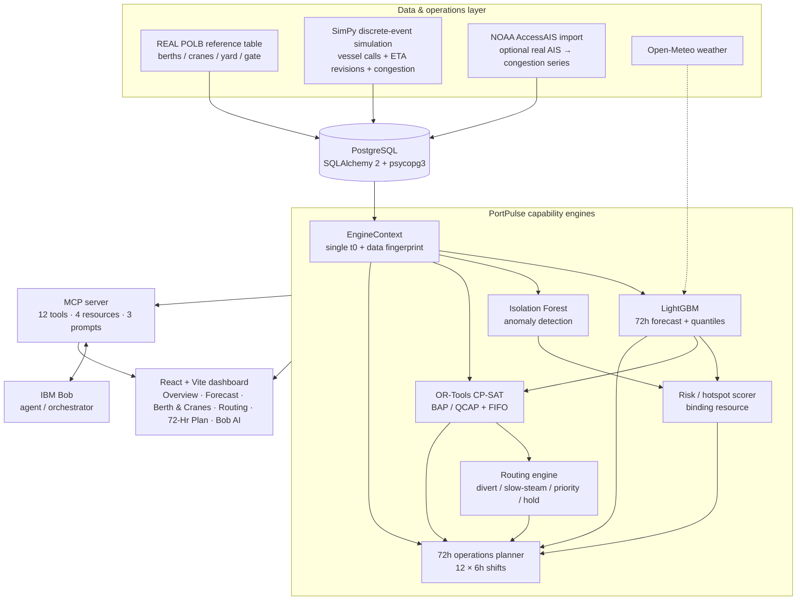

# Architecture — PortPulse AI

PortPulse AI uses a FastAPI gateway over distinct capability services, a React + Vite dashboard, PostgreSQL persistence, a SimPy synthetic operations layer, and IBM Bob as the load-bearing agentic orchestrator through MCP.

## End-to-end flow

## Data flow

The default offline path seeds the REAL Port of Long Beach terminal/berth/crane/yard/gate reference data and a reproducible **SimPy synthetic operations layer**. Synthetic congestion observations are labelled `DEMO_AIS` and are never presented as measured AIS. A separate `POST /api/ais/import` path accepts a real NOAA AccessAIS export and labels its resulting observations `AIS`.

`context.py` loads the operational state into one `EngineContext` with a shared model time `t0` and a data fingerprint. LightGBM forecasts 72 hours with uncertainty bands; Isolation Forest detects anomalies; hotspot scoring attributes a binding resource; OR-Tools CP-SAT solves berth allocation and quay-crane assignment and computes a FIFO baseline; routing converts predicted pressure into vessel actions; and the planner produces a 12-shift operating plan. `pipeline.py` orchestrates these engines, persists outputs and invalidates caches when operational inputs change.

## Component table

| Component | Responsibility | Technology |
|---|---|---|
| `backend/app/main.py` | FastAPI gateway, startup seed and provenance checks | FastAPI |
| `backend/app/reference.py` | REAL POLB terminal/reference facts | Python |
| `backend/app/seed.py` | reference seed + synthetic operations | SQLAlchemy + SimPy |
| `backend/app/services/context.py` | unified engine state + data fingerprint | SQLAlchemy |
| `backend/app/services/forecasting.py` | 72h congestion forecast + uncertainty | LightGBM |
| `backend/app/services/anomaly.py` | disruption/data-error flags | scikit-learn IsolationForest |
| `backend/app/services/hotspot.py` | risk ranking + binding resource | deterministic scorer |
| `backend/app/services/optimiser.py` | BAP/QCAP + FIFO baseline | OR-Tools CP-SAT |
| `backend/app/services/routing.py` | vessel routing actions | rule engine |
| `backend/app/services/plan.py` | 12 × 6h operations plan | Python |
| `backend/app/services/bob_agent.py` | invokes the real IBM Bob CLI | IBM Bob |
| `backend/app/mcp_server.py` | operational tools, resources and prompts | MCP |
| `backend/app/services/llm.py` | Bob-first provider resolution + deterministic fallback | Python |
| `frontend/` | supervisor dashboard and Bob surface | React + Vite + Tailwind + Recharts |

## Bob integration — load-bearing

IBM Bob is the **agent/orchestrator**, while the deterministic domain engines remain responsible for operational computation.

1. **Bob → PortPulse:** Bob acts as the MCP client and calls the relevant operational tools. The MCP server exposes 12 tools covering overview, forecasting, hotspots, anomalies, berth/crane optimisation, routing, operations planning, scenarios, vessel queries, terminals, provenance and grounded operations questions.
2. **Tools → engines:** each MCP tool executes the corresponding PortPulse engine and returns structured results. Bob is instructed to use tools before stating operational figures and never invent metrics.
3. **Bob → supervisor:** Bob synthesizes the tool results into an explanation and decision, with tool-call metadata returned to the application.
4. **Application → Bob:** `/api/bob` launches the real IBM Bob agent through `services/bob_agent.py`; the agent uses the same MCP server. Plan narration also uses Bob when available.
5. **Fallback:** if Bob is unavailable, the application returns a deterministic briefing generated from the same engine outputs. There is **no secondary external LLM provider**.

The project-level `.bob/mcp.json`, `.bob/rules/portpulse-operations.md` and `.bob/skills/port-operations-response/SKILL.md` provide persistent Bob workspace context and a reusable port-operations response workflow.

## Security and operational notes

- API keys are read from environment variables and are not stored in source code.
- The Bob CLI workspace configuration is portable and does not contain machine-specific absolute paths.
- `--trust` is used only where the Bob CLI runtime requires trusted workspace execution for the demo; production deployment should apply least-privilege workspace and MCP permissions.
- MCP tool descriptions explicitly distinguish synthetic `DEMO_AIS` from real imported `AIS` data.
- In-memory caches improve interactive latency but are not a distributed production cache.

## Data model

`Terminal → Berth / Crane / YardZone / Gate → VesselCall (+EtaRevision) → CongestionObservation → ForecastRun (+ForecastPoint) → HotspotFlag / AnomalyFlag → OptimiserRun (+Assignment) / RoutingRecommendation → OperationsPlan → Scenario → ImpactAssessment (+ChatMessage)`.

Terminal and berth capacity values come from the documented POLB reference table. Operational history is synthetic `DEMO_AIS` by default and replaceable with real NOAA AccessAIS history.

## Mapping to the hackathon template

| Template | This repo |
|---|---|
| `src/forecasting/` | `src/backend/app/services/forecasting.py` |
| `src/optimiser/` | `src/backend/app/services/optimiser.py` |
| `src/routing/` | `src/backend/app/services/routing.py` |
| `src/bob_integration/` | `src/backend/app/routers/bob.py` + `src/backend/app/services/bob_agent.py` |
| `src/data/` | `src/backend/app/reference.py` + `seed.py` + simulation + AIS pipeline |
| `docs/` | problem · solution · architecture · setup |
| `demo/`, `presentation/`, `submission.yaml` | repo root |
